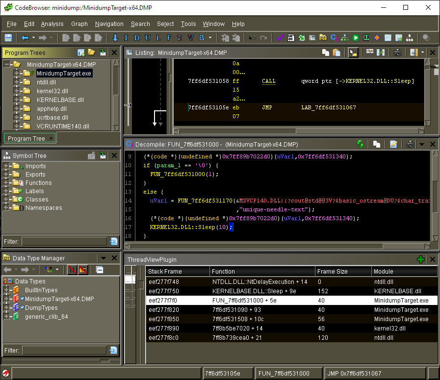

# Windows Minidump loader for Ghidra

### Work in progress

# Feature status

## Loader

- [x] Find the modules in the Minidump and load each module separately with the
  PE loader.
- [x] Position the modules to their correct runtime addresses.
- [x] Replace the use of `ImageBaseOffset..` data types with
  `ModuleBaseOffset..`.
- [x] Store the module boundaries in the `UserData`.
- [x] Load the private memory as its own fragment.
- [x] Parse the thread information and separate the thread stacks as their own
  fragments.
- [x] Find the thread information from the dump and store that into `UserData`.

## Thread view

- [x] Display threads and their RSP/RIP registers.
- [x] Implement stack walking based on exception handling `UNWIND_INFO`
  - [x] `UNWIND_CODE` based walking.
  - [x] Chained `RUNTIME_FUNCTION` support.
  - [ ] Frame register support.
  - [ ] 32-bit support.

## Other

See open issues on GitHub.

# Changes to Ghidra packages

The implementation depends heavily on the built-in `PeLoader` and
`PortableExecutable` but required some changes to them:

- Support loading modules to other base addresses than `Program.imageBase`.
- Support loading modules separately from processing them.
- Support linking import symbols directly into memory locations if target
  memory is present.
- Support for `ModuleBaseOffsetXY` data types.

The goal would be to have these changes upstreamed to Ghidra in the future to
avoid the need to duplicate the implementation of the whole `..format.pe.*`
package in the repository. However this work might need some clean up to bring
the current changes up to Ghidra standard. The current changes to the Ghidra
files are made with the goal to keep actual code changes to minimum with no
concern for single-responsibility principle, etc.

## License

The majority of the source code under this repository is covered by the Apache
2.0 License as described in the LICENSE file. The `contrib` package (excluding
the `contrib.new_` contents) is copied over from Ghidra and is covered under
[Ghidra's Apache 2.0 License][apache-ghidra].

[apache-ghidra]:
https://github.com/NationalSecurityAgency/ghidra/blob/8f8c3cfa1406cc4a78b55dac4bb284ab01333bae/LICENSE
